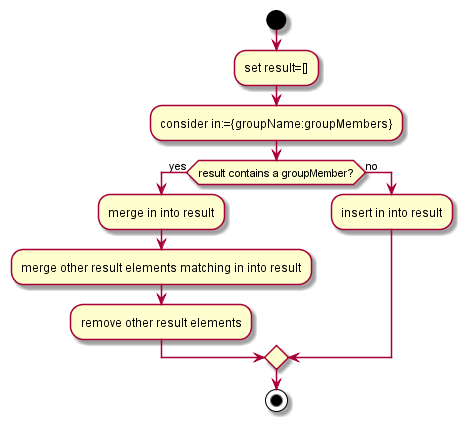
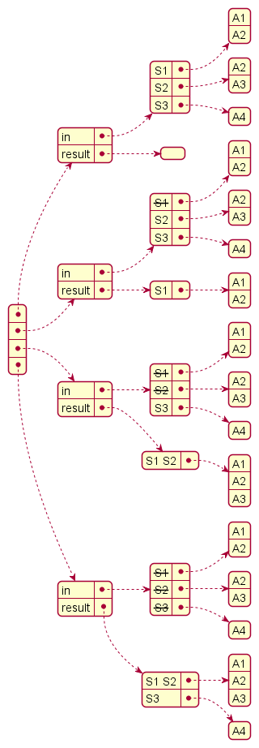

# Overview 

This project implements an algorithm for calculating 
transitive closure.

# Problem description

* Precondition:
* Given groups with elements. 
* An element may be member of more than one group.

If an element is member of more than one group, merge both groups to
a single group, containing members of both groups.

* Postcondition:
* An element is member of exactly one group.
* Silblings of the element are merged too.

# Algorithm

Describing the algorithm: 

We consider an input element and try to find a match in the result.

If there is no match we can insert the input element into the result.

If there is a match we have to merge the input into the result, and consider
all other result matches, merging them too, and removing them from the
result



Datasnapshot as the alogrithm calculates the result:




# Examples

The following examples show the input data, and the result data.

# Example 1

Given 
```
g1 := { A1, A2 }
g2 := { A2, A3 }
g3 := { A4 }
```

Resulting groups
```
g1 := { A1, A2, A3 }
g3 := { A4 }
```

# Example 2

Given 
```
g1 := { A1, A2 }
g2 := { A2, A3 }
g3 := { A4 }
g4 := { A1, A4 }
```

Resulting groups
```
g1 := { A1, A2, A3, A4 }
```
# Example 3

Given 
```
g1 := { A2, A4 }
g2 := { A1 }
g3 := { A4, A6 }
g4 := { A3 }
```

Resulting groups
```
g1 := { A2, A4, A6 }
g2 := { A1 }
g4 := { A3 }
```
 
# References

* https://en.wikipedia.org/wiki/Transitive_closure#Algorithms
